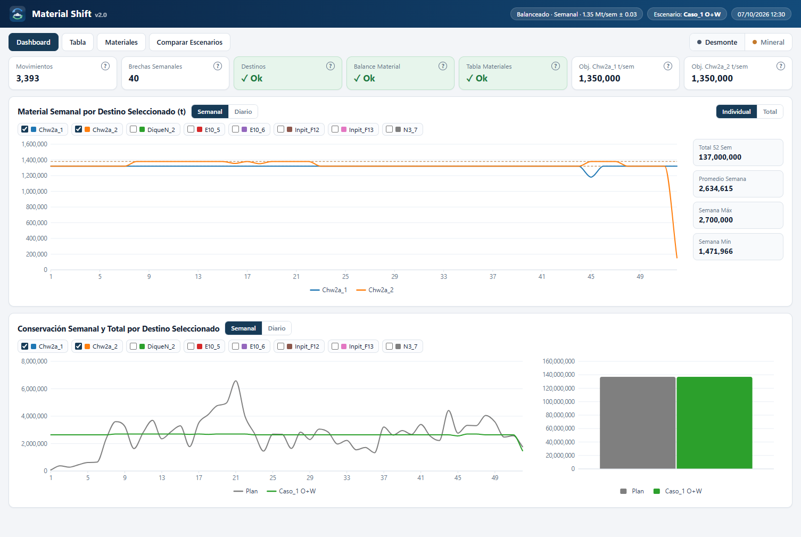
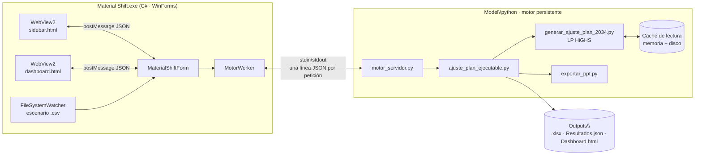
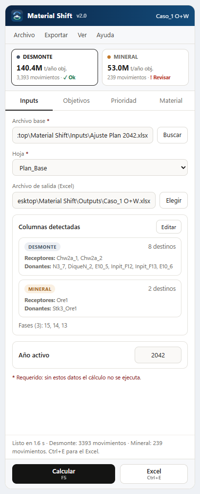
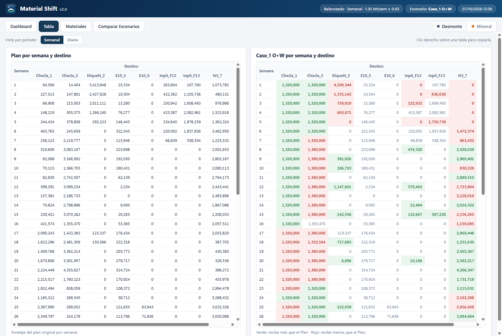
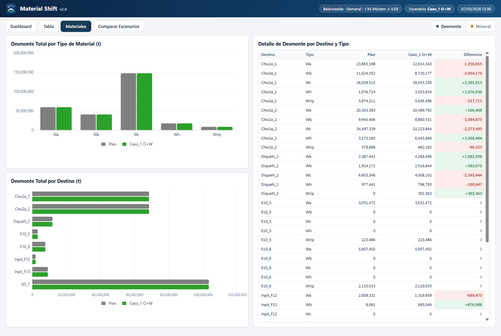
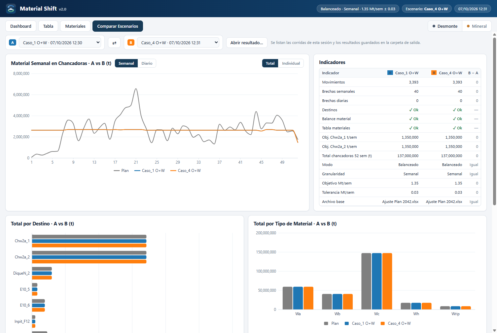

# Material Shift v2.0

**Material Shift** es una aplicación de escritorio para Windows que **reasigna el tonelaje** de un plan de minado semana a semana. Mueve material entre las **chancadoras (receptores)** y los **destinos donantes** para que cada chancadora reciba un tonelaje objetivo dentro de una banda de tolerancia, **sin cambiar el total anual de ningún destino** ni el total de cada fila del plan.

Trabaja con dos circuitos independientes, cada uno con su propio criterio:

- **Desmonte** — materiales de desmonte `Wa`, `Wb`, `Wc`, `Wh`, `Wrell`, `Wrip`.
- **Mineral** — materiales de mineral `M1`, `M2`, `M2a`, `M2at`, `M4b`, `M4bt`, `M5`, `M6`.

Es el sucesor del *Modelo de Reasignación de Materiales v19.5*. El motor de cálculo da **resultados idénticos** a esa versión, verificado celda por celda (ver [Verificación](#13-verificación)).



---

## Índice

1. [Características](#1-características)
2. [Requisitos y ejecución](#2-requisitos-y-ejecución)
3. [Estructura del repositorio](#3-estructura-del-repositorio)
4. [Arquitectura](#4-arquitectura)
5. [Datos de entrada](#5-datos-de-entrada)
6. [Lógica del modelo](#6-lógica-del-modelo)
7. [Interfaz](#7-interfaz)
8. [Formato del escenario (.csv v3)](#8-formato-del-escenario-csv-v3)
9. [Salidas](#9-salidas)
10. [Motor por línea de comandos](#10-motor-por-línea-de-comandos)
11. [Rendimiento](#11-rendimiento)
12. [Compilar desde el código fuente](#12-compilar-desde-el-código-fuente)
13. [Verificación](#13-verificación)
14. [Historial de versiones](#14-historial-de-versiones)

---

## 1. Características

- **Optimización exacta:** un programa lineal (SciPy · HiGHS) resuelve las 52 semanas a la vez, con conservación anual por destino como restricción de igualdad.
- **Dos circuitos (Desmonte y Mineral)**, cada uno con su propio modo, granularidad, objetivo y tolerancia.
- **Dos modos:**
  - *Objetivo fijo:* cada chancadora apunta al objetivo semanal.
  - *Balanceado:* además acerca las dos chancadoras entre sí.
- **Granularidad semanal o diaria:** un refinamiento opcional suaviza los días dentro de cada semana sin alterar los totales semanales.
- **Prioridades por chancadora:** orden de donantes y de fases que se arrastra con el mouse.
- **Matriz de materiales:** define qué destino puede recibir o entregar cada tipo de material.
- **Validaciones automáticas** con indicadores en verde («✓ Ok») o rojo («! Revisar»):
  - conservación por destino;
  - balance destino/material por fila;
  - respeto de la matriz de materiales;
  - brechas semanales y diarias.
- **Dashboard interactivo sin internet:**
  - gráficos SVG propios;
  - vistas Semanal/Diario;
  - pestañas Tabla y Materiales;
  - **comparación de escenarios A vs B**.
- **Exportación:**
  - Excel del Plan Modificado y reporte completo;
  - PowerPoint con **gráficos nativos editables**;
  - imagen PNG;
  - tablas con formato;
  - dashboard HTML independiente.
- **Escenarios en `.csv` legible**, que se pueden editar en Excel. Si el archivo cambia por fuera del programa, la app avisa sin perder la corrida.
- **Portable:** no requiere instalación. Python, el motor y el visor van dentro de `Model\`.
- **Ergonomía:**
  - modo noche;
  - atajos de teclado;
  - diálogos centrados;
  - la ventana recuerda su tamaño y posición;
  - escenarios recientes;
  - aviso de cambios sin guardar solo cuando hay cambios.

---

## 2. Requisitos y ejecución

| Componente | Versión |
|---|---|
| Sistema operativo | Windows 10/11 x64 |
| .NET Framework | 4.8 (incluido en Windows) |
| Microsoft Edge WebView2 Runtime | Incluido en Windows 11; en Windows 10 se instala desde Microsoft |
| Python (portable, en `Model\python`) | 3.12 |
| Paquetes Python usados por el motor | `numpy`, `scipy` (HiGHS), `xlsxwriter`, `python-pptx` |
| PowerPoint (opcional) | Solo para *Copiar como gráfico de PowerPoint* al portapapeles |

**Ejecutar:** doble clic en `Material Shift.exe`.

**Flujo básico:**

1. **Inputs** → elegir *Archivo base* (`.xlsx`) y *Hoja*. Las columnas se detectan solas.
2. **Objetivos · Prioridad · Material** → ajustar el criterio de cada circuito.
3. **Calcular** (`F5`) → el dashboard aparece a la derecha en ~2 s.
4. **Excel** (`Ctrl+E`) → escribe el *Plan Modificado* con el nombre de *Archivo de salida*.
5. **Guardar** (`Ctrl+S`) → guarda el escenario como `.csv`.

---

## 3. Estructura del repositorio

```
Material Shift/
├── Material Shift.exe              Programa (WinForms + WebView2)
├── Escenarios/                     Escenarios .csv de ejemplo (Casos 1–5)
├── Inputs/                         Planes base .xlsx
├── Outputs/                        Excel y resultados de cada corrida
├── Model/
│   ├── app/
│   │   ├── generar_ajuste_plan_2034.py   Núcleo: lectura del Excel, LP, refinamiento diario, validaciones
│   │   ├── ajuste_plan_ejecutable.py     Orquestación por circuito, salidas Excel/JSON/HTML, CLI
│   │   ├── motor_servidor.py             Proceso persistente (stdin/stdout JSON)
│   │   ├── exportar_ppt.py               Gráficos nativos de PowerPoint (python-pptx)
│   │   ├── sidebar.html                  Barra lateral (configuración)
│   │   └── dashboard.html                Dashboard (resultados y comparación)
│   ├── bin/                        Microsoft.Web.WebView2.Core/WinForms.dll, WebView2Loader.dll
│   ├── python/                     Python 3.12 portable
│   ├── recursos/                   Logo (PNG 32/64/128) e ícono .ico
│   └── Preferencias/               preferencias.json (se crea al usar el programa)
├── Desarrollo/
│   ├── Codigo Fuente/
│   │   ├── MaterialShift.cs        Código C# del ejecutable
│   │   ├── compilar.ps1            Compila el .exe con csc.exe
│   │   ├── crear_icono.py          Dibuja el logo y genera el .ico
│   │   └── incrustar_logo.py       Incrusta el logo (base64) en las páginas HTML
│   └── Verificacion/
│       ├── comparar_resultados.py  Comparación celda por celda contra v19.5
│       ├── reproducir_escenario.py Reproduce un escenario .csv con un motor dado
│       ├── prueba_interfaz.py      Prueba automática de la interfaz (CDP, 27 casos)
│       ├── prueba_portapapeles.py  Prueba del portapapeles (imagen, HTML, texto)
│       ├── cdp.py                  Cliente mínimo de Chrome DevTools Protocol
│       ├── Capturas/               Capturas de pantalla
│       └── Verificacion de Calculos.md
└── Leame.md                        Guía rápida de uso
```

---

## 4. Arquitectura



### 4.1 Ejecutable (C#)

`Desarrollo/Codigo Fuente/MaterialShift.cs` está escrito en C# 5, porque compila con el `csc.exe` de .NET Framework 4.8.

| Clase | Responsabilidad |
|---|---|
| `Program` | Punto de entrada. Resuelve los DLL de WebView2 desde `Model\bin` (`AssemblyResolve`). |
| `Paths` | Rutas de la carpeta portable y de `%LOCALAPPDATA%\Material Shift` (datos de WebView2 y caché). |
| `MotorWorker` | Arranca `motor_servidor.py` una sola vez y le envía peticiones con `id`; espera la respuesta `{"id","rc","output"}`. |
| `MaterialShiftForm` | Ventana principal con dos WebView2 (barra lateral y dashboard) y divisor redimensionable. Se encarga de: <br>• escenarios (abrir, guardar, CSV v2/v3/JSON); <br>• preferencias; <br>• vigilancia del `.csv`; <br>• portapapeles (texto, HTML, PNG/DIB, gráfico de PowerPoint vía COM); <br>• diálogos centrados; <br>• exportaciones. |
| `SessionRun` | Corridas de la sesión (las últimas 12), que se usan en *Comparar Escenarios*. |
| `MaterialMatrixForm` | Ventana nativa de la matriz destino × material. |
| `PrioItem`, `Crit`, `ProcResult` | Modelos de datos: elemento de prioridad, criterio por circuito y resultado de un proceso. |

**Comunicación con las páginas:** `chrome.webview.postMessage` con objetos `{type: ...}`. Algunos mensajes:

- *Sidebar → host:* `calc`, `excel`, `save`, `open`, `detect`, `matrix`, `close`.
- *Dashboard → host:* `copy`, `png`, `ppt`, `compare`, `openResult`, `close`.
- *Host → páginas:* `state`, `columns`, `results`, `runs`, `notice`, `theme`.

### 4.2 Motor persistente

`motor_servidor.py` carga Python, NumPy y SciPy **una sola vez**.

**Protocolo** (una línea JSON por mensaje):

```text
→ {"id": 7, "argv": ["--nogui", "--list-columns", "--input", "...xlsx", "--sheet", "Plan_Base"]}
← {"id": 7, "rc": 0, "output": "...COLUMNS_RESULT:{...}"}
→ {"cmd": "exit"}
```

**Cómo atiende cada petición:**

- Antes de cada petición se recargan los módulos del motor (`importlib.reload`). Así las variables globales vuelven a sus valores por defecto y el resultado es idéntico al de un proceso nuevo.
- Solo sobrevive la **caché de lectura del Excel**:
  - la clave es SHA1 de ruta + hoja + tamaño + fecha de modificación;
  - los valores se guardan serializados con *pickle*, así que cada uso recibe una copia nueva;
  - está en memoria y en disco (`%LOCALAPPDATA%\Material Shift\cache`);
  - editar el Excel la invalida automáticamente.

---

## 5. Datos de entrada

### 5.1 Hoja del plan base (por defecto `Plan_Base`)

| Elemento | Formato |
|---|---|
| Encabezados | **Fila 4**, desde la columna **B** hasta la última columna con encabezado |
| Datos | Desde la **fila 5** hasta la última fila con valor en la columna B, sin límite fijo de filas ni columnas |
| Columnas usadas | `Semana`, `Fecha Liberación` (fecha serial de Excel), `Fase`, `Poligono / Origen`, `# Sec`, `Cota`, `Total Material (t)` |
| Destinos | Columnas de tonelaje por destino (chancadoras, donantes, botaderos, áreas de stock) |
| Materiales | Columnas de tonelaje por tipo: `Wa…Wrip` (desmonte) y `M1…M6` (mineral) |

El lector es propio: recorre el XML del `.xlsx` en streaming, sin openpyxl, para leer rápido libros de ~27 MB. Se leen los **valores ya calculados** de las celdas; las fórmulas no se evalúan.

### 5.2 Hoja `Config` (opcional)

Define el rol y el circuito de cada columna de destino. Encabezados aceptados (sin importar acentos ni mayúsculas):

| Columna (o Destino/Nombre) | Config_Destinos | Config_Materiales |
|---|---|---|
| `Chw2a_1` | Receptor | Desmonte |
| `DiqueN_2` | Donante | Desmonte |
| `Ore1` | Receptor | Mineral |
| `Stk3_Ore1` | Donante | Mineral |
| `Botadero 9` | N/A | N/A |

**Sin hoja `Config`** la detección es por nombre y solo existe el circuito Desmonte:

- chancadoras = columnas que contienen `Chw2a`;
- donantes = columnas entre la última chancadora y la primera columna de material, excluyendo las que contienen `Botadero`.

Desde la app (**Inputs › Columnas detectadas › Editar**) se puede definir o corregir esta configuración sin tocar el Excel. Se guarda en la sección `[Config Destinos]` del escenario.

---

## 6. Lógica del modelo

El cálculo de un clic en **Calcular** sigue estos pasos:

```
leer plan (caché) → resolver circuitos → por circuito:
    filas elegibles → LP anual por semana → aplicar flujos a filas
    → [refinamiento diario] → validaciones → series del dashboard
→ combinar circuitos → escribir salidas
```

### 6.1 Resolución de circuitos

Para cada circuito (`Desmonte`, `Mineral`) se obtienen:

- sus **chancadoras**: columnas *Receptor* del circuito;
- sus **donantes**: columnas *Donante* del circuito;
- sus **materiales**: las columnas `Wa…Wrip` para Desmonte o `M1…M6` para Mineral que existan en el archivo.

Si un circuito no tiene receptores, no se calcula. El mismo motor resuelve ambos circuitos: se cambian temporalmente las listas globales (`CHANCADORES`, `DONORS`, `WASTE_TYPES`) mientras dura la llamada.

### 6.2 Filas elegibles

Una fila participa en la reasignación si cumple las tres condiciones:

1. El año de `Fecha Liberación` es el **año activo**. Se sugiere el año más frecuente del archivo y se puede editar.
2. `Semana` está entre 1 y 52.
3. Su **tipo de material** pertenece al circuito. El tipo es la primera columna de material del circuito con tonelaje > 0.

Las demás filas se copian sin cambios.

### 6.3 Programa lineal (una sola optimización para las 52 semanas)

**Índices:** semana $w \in \{1..52\}$, chancadora $c$, donante $d$, material $m$.

**Datos del plan base:**

- $D_{w,d,m}$: tonelaje del donante $d$ con material $m$ en la semana $w$.
- $B_{w,c,m}$: tonelaje de la chancadora $c$ con material $m$ en la semana $w$.
- $B_{w,c} = \sum_m B_{w,c,m}$.
- $T$: objetivo semanal. $\tau$: tolerancia (por defecto, 1 % de $T$).
- $r_c(d)$: posición del donante $d$ en la prioridad de la chancadora $c$. Empieza en 0; un donante sin posición recibe $|D|+1$.

**Variables** (todas $\ge 0$):

| Variable | Significado |
|---|---|
| $x^{+}_{w,c,d,m}$ | toneladas que pasan del donante $d$ a la chancadora $c$ |
| $x^{-}_{w,c,d,m}$ | toneladas que la chancadora $c$ devuelve al donante $d$ |
| $s^{-}_{w,c},\ s^{+}_{w,c}$ | déficit y exceso fuera de la banda (holguras) |
| $\delta_w$ | diferencia entre las dos chancadoras (solo en modo *Balanceado*) |

**Función objetivo:**

$$
\min \sum_{w,c,d,m}\Big[(r_c(d)+1)\,x^{+}_{w,c,d,m} + 0.1\,x^{-}_{w,c,d,m}\Big] + M\sum_{w,c}\big(s^{-}_{w,c}+s^{+}_{w,c}\big) + \lambda\sum_w \delta_w
$$

con $M = 10^7$, $\lambda = 2$ en modo *Balanceado* con exactamente dos chancadoras y $\lambda = 0$ en otro caso.

**Lectura de la función objetivo:**

- La holgura $M$ domina, así que primero se busca **entrar en la banda**.
- Luego se prefieren los **donantes de mayor prioridad**.
- Las devoluciones $x^-$ son baratas pero no gratuitas, lo que evita mover material sin necesidad.

**Restricciones:**

$$
\begin{aligned}
&\textstyle\sum_c x^{+}_{w,c,d,m} \le D_{w,d,m} && \text{(oferta del donante, por material)}\\
&\textstyle\sum_d x^{-}_{w,c,d,m} \le B_{w,c,m} && \text{(lo que la chancadora puede devolver)}\\
&Q_{w,c} = B_{w,c} + \textstyle\sum_{d,m} x^{+}_{w,c,d,m} - \sum_{d,m} x^{-}_{w,c,d,m} && \text{(tonelaje resultante)}\\
&Q_{w,c} + s^{-}_{w,c} \ge T - \tau,\qquad Q_{w,c} - s^{+}_{w,c} \le T + \tau && \text{(banda semanal)}\\
&|Q_{w,c_1} - Q_{w,c_2}| \le \delta_w && \text{(solo Balanceado)}\\
&\textstyle\sum_{w,c,m}\big(x^{+}_{w,c,d,m} - x^{-}_{w,c,d,m}\big) = 0 \quad \forall d && \text{(conservación anual del donante)}\\
&\textstyle\sum_{w,d,m}\big(x^{+}_{w,c,d,m} - x^{-}_{w,c,d,m}\big) = 0 \quad \forall c && \text{(conservación anual de la chancadora)}\\
&x^{\pm}_{w,c,d,m} = 0 \ \text{si } m \text{ está bloqueado en } c \text{ o en } d && \text{(matriz de materiales)}
\end{aligned}
$$

**Propiedades que garantiza el modelo:**

- El material solo se mueve **entre chancadora y donante**, nunca de chancadora a chancadora.
- Lo que un donante cede en una semana lo recupera en otras semanas del año. Solo cambia **cuándo** llega el material, nunca **cuánto** recibe cada destino en el año.
- Si los donantes de una semana no alcanzan para entrar en la banda, la semana se informa como **«Brecha por restricciones locales»**. No se inventa tonelaje.
- Se resuelve con `scipy.optimize.linprog(method="highs")` usando matrices dispersas. Para el plan 2042 (Desmonte) toma menos de 1 s.

**Matriz de materiales por defecto:** todo está permitido, salvo que los donantes de Tucush (`N2_1`, `N2_2`, `N2_3`, `N3_7`) no reciben ni entregan `Wa`.

### 6.4 Aplicación de los flujos a las filas

El LP entrega flujos netos por semana, chancadora, donante y material. Esos flujos se reparten entre las filas del Excel de esa semana y ese material. El tonelaje se traslada **dentro de la misma fila**, de la columna del donante a la de la chancadora o al revés, así que **el total de cada fila no cambia**.

| Flujo neto | Orden en que se toman las filas |
|---|---|
| Donante → chancadora | Prioridad de **fase** de esa chancadora, luego `Poligono / Origen` y luego `# Sec`, en forma ascendente |
| Chancadora → donante | Primero la fase de **menor** prioridad y luego el `# Sec` más alto, es decir, se devuelve lo último planificado |

Cada traslado queda registrado como un **movimiento**: semana, fila, fase, cota, polígono, material, desde, hacia y toneladas.

### 6.5 Refinamiento diario (granularidad *Diario*)

Se ejecuta después del LP, para cada semana y cada chancadora. Reparte el tonelaje entre los días de la semana según `Fecha Liberación`:

1. **Objetivo diario:**
   - el valor que define el usuario (Mt/día);
   - si no lo define, el total de la semana dividido entre los días con datos.
2. **Presupuesto:** se calcula $\min(\text{falta total}, \text{exceso total})$ de la semana. Con eso, lo que se llena siempre puede devolverse.
3. **Paso A · llenar:** los días bajo la banda toman material de los donantes **del mismo día**, en orden de prioridad de fase y de donante. Lo tomado se anota en un libro de cuentas por donante.
4. **Paso B · drenar:** los días sobre la banda devuelven material a los donantes según ese libro de cuentas, respetando la matriz de materiales.
5. **Cierre:** lo que quede pendiente se devuelve desde cualquier fila de la semana que el donante acepte. Como último recurso se deshace el movimiento original.
6. **Red de seguridad:** si la semana no cierra exactamente, se deshace el suavizado de esa semana. El resultado semanal se mantiene y las brechas diarias se informan tal como quedan.

Los totales **semanales y anuales** por destino no cambian. Los días fuera de banda se informan como «Brecha diaria».

### 6.6 Validaciones (indicadores del dashboard)

| Indicador | Regla | Estado |
|---|---|---|
| **Destinos** | Total anual de cada destino: Plan vs escenario, con diferencia ≤ 1e-5 t | ✓ Ok / ! Revisar |
| **Balance Material** | En cada fila, Σ destinos del circuito = Σ materiales del circuito, con desviación ≤ 0.05 % | ✓ Ok / ! Revisar (n filas) |
| **Tabla Materiales** | Cada celda bloqueada de la matriz conserva exactamente el tonelaje del Plan | ✓ Ok / ! Revisar (n) |
| **Brechas semanales** | Semanas × chancadora fuera de $[T-\tau,\ T+\tau]$ | número |
| **Brechas diarias** | Días × chancadora fuera de la banda diaria (solo en *Diario*) | número |
| **Filas** | Total de las columnas destino de cada fila, sin cambios | interno |

Un «Balance Material: Revisar» en Mineral casi siempre significa que falta marcar como donante una columna que sí tiene tonelaje en el Excel. No es un error de cálculo.

### 6.7 Combinación de circuitos

Cada circuito modifica solo sus propias columnas de destino. El **Plan Modificado** final se arma columna por columna: cada circuito aporta sus columnas y el resto se toma del plan base. No hay suma numérica entre circuitos, porque cada columna pertenece a un solo circuito.

---

## 7. Interfaz

La ventana se divide en una **barra lateral** a la izquierda (configuración, redimensionable) y el **dashboard** a la derecha (resultados). Las dos son páginas HTML que se muestran en WebView2. Usan JavaScript sin frameworks y gráficos SVG propios, y no cargan nada de internet.

<p align="center">
  
</p>

### 7.1 Barra lateral

| Zona | Contenido |
|---|---|
| **Encabezado** | Logo, «Material Shift v2.0» y nombre del escenario, con un punto «•» si hay cambios sin guardar. |
| **Menús** | **Archivo:** Nuevo, Abrir, Recientes, Guardar, Guardar como, Salir. <br>**Exportar:** Excel · Plan Modificado, Excel · Reporte completo, PowerPoint, Dashboard en el navegador, Abrir carpeta de salida. <br>**Ver:** modo noche, Comparar. <br>**Ayuda:** guía rápida, atajos, acerca de. |
| **Tarjetas KPI** | Una por circuito: objetivo anual, movimientos y estado (✓ Ok / ! Revisar). Un clic cambia de circuito en toda la app. |
| **Pestaña Inputs** | *Archivo base* \*, *Hoja* \* (lista con las hojas del libro), *Archivo de salida*, **Columnas detectadas** por circuito (receptores, donantes y fases) con el editor *Editar*, y *Año activo*. |
| **Pestaña Objetivos** | Subpestañas **Desmonte \| Mineral**. Cada una con Modo (*Objetivo fijo / Balanceado*), Granularidad (*Semanal / Diario*), Objetivo Mt/sem, Tolerancia (Mt o %), Objetivo Mt/día y Tolerancia diaria. |
| **Pestaña Prioridad** | Por circuito y por chancadora, dos columnas numeradas: **1. Donantes** y **2. Fases**. <br>• Cada elemento tiene asa ≡ y casilla *Usar*. <br>• Se reordena **arrastrando** o con `Alt+↑/↓`. <br>• Botones *Restablecer* y *Copiar a la otra chancadora*. |
| **Pestaña Material** | Matriz destino × material por circuito: 1 = puede recibir y entregar ese material, 0 = no se toca. También se abre en una ventana nativa, donde un clic en el encabezado marca o desmarca la columna completa. |
| **Pie** | Estado con el tiempo transcurrido, aviso **«Nuevo escenario disponible… ¿Desea actualizar?»** (*Actualizar / Ignorar*) y botones **Calcular** (`F5`) y **Excel** (`Ctrl+E`). |

Los campos requeridos llevan un **\*** en rojo oscuro. Si falta alguno, *Calcular* no se ejecuta y el campo se señala.

### 7.2 Dashboard

**Encabezado (azul):** logo y chips con el criterio del circuito (p. ej. «Balanceado · Semanal · 1.35 Mt/sem ± 0.03»), el escenario y la fecha de la corrida. Debajo están las vistas y el selector de circuito **Desmonte | Mineral**, sincronizado con la barra lateral.

**Leyendas:** la serie original se llama **«Plan»** (gris) y la resultante lleva **el nombre del escenario** (verde). En la comparación, A es azul y B es naranja.

#### Vista *Dashboard*

- **Indicadores:**
  - Movimientos;
  - Brechas semanales (o diarias);
  - **Destinos**, **Balance Material** y **Tabla Materiales**, con fondo verde claro «✓ Ok» o rojo claro «! Revisar»;
  - objetivo de cada chancadora.

  Cada indicador tiene una ayuda **?**.
- **Material Semanal/Diario por Destino Seleccionado:**
  - casillas por destino;
  - modo *Individual / Total*;
  - línea de objetivo;
  - panel con Total, Promedio, Máximo y Mínimo.
- **Conservación Semanal y Total por Destino Seleccionado:** línea Plan vs escenario y barras con el total anual.
- Cada gráfico tiene botones **Semanal | Diario** y el título cambia según la vista.

#### Vista *Tabla*

Dos tablas lado a lado: **Plan por semana y destino** y **‹Escenario› por semana y destino**. Las celdas en verde reciben más que el Plan y las rojas menos. Se pueden ver por semana o por día.



#### Vista *Materiales*

Total por tipo de material (barras Plan vs escenario), total por destino (barras horizontales) y el detalle **Destino × Tipo** con las columnas Plan, escenario y diferencia.



#### Vista *Comparar Escenarios*

- Selectores **A** y **B**, con las corridas de la sesión y los `- Resultados.json` guardados, más el botón **⇄** y *Abrir resultado…*.
- Gráfico **A vs B** con el Plan de referencia (Total o por chancadora, semanal o diario).
- Tabla de **Indicadores** con las columnas A, B y **B − A**: movimientos, brechas, estados, objetivos, totales, modo, granularidad, objetivo, tolerancia y archivo base.
- Totales por destino y por tipo de material A vs B, y el detalle por período.



Sin corridas, el dashboard muestra una **portada** con los pasos, los atajos y los escenarios recientes.

### 7.3 Menú contextual (clic derecho)

| Sobre un gráfico | Sobre una tabla |
|---|---|
| Copiar datos (texto tabulado para Excel) | Copiar tabla |
| Copiar como imagen (PNG a 2×) | Copiar con formato (HTML) |
| Guardar imagen… | Copiar como imagen |
| **Copiar como gráfico de PowerPoint (editable)** | |
| Exportar a PowerPoint (.pptx) / todos los gráficos de la vista | |

*Copiar como gráfico de PowerPoint* funciona así:

1. `exportar_ppt.py` crea un `.pptx` con un gráfico nativo (líneas, columnas o barras).
2. PowerPoint, vía COM, copia esa forma al portapapeles.
3. Al pegar en PowerPoint aparece un gráfico editable, con sus datos en una hoja Excel incrustada.

### 7.4 Atajos de teclado

| Atajo | Acción | Atajo | Acción |
|---|---|---|---|
| `F5` | Calcular | `Ctrl+E` | Excel · Plan Modificado |
| `Ctrl+N` / `Ctrl+O` | Nuevo / Abrir escenario | `Ctrl+Shift+E` | PowerPoint · gráficos |
| `Ctrl+S` / `Ctrl+Shift+S` | Guardar / Guardar como | `Ctrl+Shift+C` | Comparar escenarios |
| `Ctrl+Tab` | Cambiar circuito | `Ctrl+Shift+M` | Modo noche |
| `Alt+↑/↓` | Mover fila en Prioridad | `F1` | Guía rápida |

### 7.5 Diseño y comportamiento

- **Logo:** cuadrado redondeado con degradado azul profundo (`#0B2545 → #134B7A`), flechas de reasignación de azul a verde, pilas de acopio y signos −/+. Lo genera `crear_icono.py`.
- **Tema:** colores definidos como variables CSS; modo claro gris suave y **modo noche** completo en ambas páginas.
- **Ventana:**
  - recuerda tamaño, posición, maximizado y ancho de la barra lateral (`Model\Preferencias\preferencias.json`);
  - se reacomoda a media pantalla y a cuadrante.
- **Diálogos** (abrir, guardar, exportar): tamaño medio, centrados sobre el programa. Al cerrarlos, el foco vuelve a la página.
- **Escenario vigilado:**
  - si el `.csv` abierto cambia por fuera, se compara su contenido (con una espera de 700 ms) y aparece el aviso en el pie;
  - los guardados del propio programa no generan aviso;
  - al actualizar, la corrida se conserva y se marca como desactualizada.
- **Cerrar:** solo pregunta si hay cambios sin guardar. `Alt+F4` funciona aunque el foco esté en la página.
- **Escenarios de otra PC:** si la ruta del *Archivo base* no existe, se busca el mismo nombre junto al escenario y en `Inputs\`.

---

## 8. Formato del escenario (.csv v3)

Es un CSV con separador `;` y codificación UTF-8 con BOM, para que Excel lo abra con acentos. Está organizado en secciones entre corchetes. Los escenarios v2 (`.csv/.txt`) y `.json` de v19 se siguen abriendo y dan el mismo resultado.

```text
sep=;
Escenario Material Shift;version 3
Puedes editar los valores en Excel. No cambies los nombres de las secciones entre corchetes.

[General]
Archivo base;...\Inputs\Ajuste Plan 2042.xlsx
Archivo de salida;...\Outputs\Caso_5 Mineral completo.xlsx
Hoja;Plan_Base
Año activo;2042

[Objetivos]
Parámetro;Desmonte;Mineral
Modo;Objetivo fijo;Objetivo fijo
Granularidad;Semanal;Semanal
Objetivo Mt/sem;2.60;1.00
Tolerancia;0.05;0.05
Unidad de tolerancia;Mt;Mt
Objetivo Mt/día;0.170;0.150
Tolerancia diaria Mt;0.020;0.020

[Donantes 1]
Chancadora;Chw2a_1
Orden;Columna;Usar
1;DiqueN_2;Si
2;E10_5;Si
...

[Fases 1]            ← también [Donantes 2], [Fases 2], [Donantes Mineral], [Fases Mineral]
Chancadora;Chw2a_1
Orden;Columna;Usar
1;PHASE 13;Si
...

[Config Destinos]
Destino;Config_Destinos;Config_Materiales
Ore1;Receptor;Mineral
Chw2a_1;Receptor;Desmonte
Stk3_Ore1;Donante;Mineral
Botadero 9;N/A;N/A
...

[Materiales]
Nota;"1 = ese destino puede recibir y entregar ese material; 0 = ese material no se toca en ese destino"
Destino;Wa;Wb;Wc;Wh;Wrip
Chw2a_1;1;1;1;1;1
N3_7;0;1;1;1;1

[Materiales Mineral]
Destino;M1;M2;M2a;M2at;M4b;M4bt;M5;M6
Ore1;1;1;1;1;1;1;1;1
```

---

## 9. Salidas

Todas se escriben en la carpeta del *Archivo de salida*.

| Archivo | Cuándo | Contenido |
|---|---|---|
| `<salida>.xlsx` | **Excel** (`Ctrl+E`) | Hoja **Plan Modificado** combinada (ambos circuitos), con el mismo formato y columnas que el plan base |
| `<salida> - Reporte completo.xlsx` | Exportar › Excel · Reporte completo | Por circuito (las hojas de Mineral llevan el sufijo « Mineral»): `Dashboard` (gráfico semanal; solo si las chancadoras son `Chw2a_1/Chw2a_2`), `Dashboard App`, `Plan Base`, `Plan Modificado`, `Validacion`, `Resumen <circuito>`, `Movimientos`, `Parametros` |
| `<escenario> - Resultados.json` | Cada **Calcular** | Datos del dashboard por circuito; se usa en *Comparar Escenarios* |
| `<escenario> - Dashboard.html` | Cada **Calcular** | El mismo dashboard con los datos incrustados, para abrir en cualquier navegador sin el programa |
| `.pptx` | Exportar › PowerPoint | Diapositivas 16:9 con gráficos nativos editables |

**Estructura de `Resultados.json`:**

```json
{
  "tipo": "Material Shift - Resultados", "version": 1,
  "escenario": "Caso_5 Mineral completo",
  "fecha": "07/10/2026 12:30", "archivo_base": "...xlsx", "hoja": "Plan_Base", "anio_activo": 2042,
  "circuitos": {
    "Desmonte": {
      "destinations": [], "chancadoras": [], "materialTypes": [],
      "baseMaterialWeekDest": [], "materialWeekDest": [],
      "baseMaterialDayDest": [], "materialDayDest": [],
      "conservationTotal": [], "conservationWeekDest": [], "conservationDayDest": [],
      "movementWeekDest": [], "wasteDestDetail": [],
      "summary": {"movimientos": 0, "brechas": 0, "brechas_diarias": 0, "destinos_ok": true,
                  "balance_material_ok": true, "matriz_ok": true, "lp_ok": true},
      "targets": {}, "tolerances": {}, "granularity": "semanal",
      "settings": {"modo": "", "objetivo_mt": 0, "tolerancia_mt": 0, "granularidad": "", "donantes": []}
    },
    "Mineral": { }
  }
}
```

Los nombres de hoja del Excel (*Plan Base*, *Plan Modificado*) se mantienen como en v19.5 para no romper procesos que ya los usen. En la interfaz se muestran como «Plan» y el nombre del escenario.

---

## 10. Motor por línea de comandos

El motor también se puede usar sin la interfaz:

```bash
Model\python\python.exe Model\app\ajuste_plan_ejecutable.py --nogui --input "Inputs\Ajuste Plan 2042.xlsx" --output "Outputs\Prueba.xlsx" --target-mode balanceado --target-mt 1.35 --tolerance-mt 0.03 --scenario-name Prueba
```

| Argumento | Descripción |
|---|---|
| `--input`, `--output`, `--sheet` | Archivo base, salida y hoja (por defecto `Plan_Base`) |
| `--target-mode` | `objetivo_fijo` o `balanceado` |
| `--target-mt`, `--tolerance-mt` | Objetivo y tolerancia semanal por chancadora (Mt) |
| `--granularity` | `semanal` o `diario` |
| `--daily-target-mt`, `--daily-tolerance-mt` | Objetivo y banda diaria (Mt) |
| `--donor-priority`, `--phase-priority` | JSON `{chancadora: [ids en orden]}` (Desmonte) |
| `--mineral-donor-priority`, `--mineral-phase-priority` | JSON `[ids en orden]` (Mineral) |
| `--mineral-target-mt`, `--mineral-tolerance-mt`, `--mineral-target-mode`, `--mineral-granularity`, `--mineral-daily-target-mt`, `--mineral-daily-tolerance-mt` | Criterio propio de Mineral. Si se omiten, se usa el de Desmonte. |
| `--material-matrix` | JSON `{destino: [materiales bloqueados]}` |
| `--destino-config` | JSON `{destino: {"destino": "Receptor/Donante/N/A", "material": "Desmonte/Mineral/N/A"}}` |
| `--donantes-override` | JSON con la lista de donantes (sin hoja `Config`) |
| `--active-year` | Año activo |
| `--list-columns` | Solo detecta columnas, fases, hojas y circuitos (`COLUMNS_RESULT:{...}`) |
| `--excel-only` | Solo el Plan Modificado, con el nombre exacto de `--output` |
| `--dashboard-only` | Solo `Resultados.json` y `Dashboard.html` |
| `--full-report` | Solo el reporte Excel completo |
| `--pptx-chart <spec.json>` | Crea un `.pptx` con gráficos nativos |
| `--scenario-name`, `--cache-dir` | Nombre del escenario y carpeta de la caché |

La salida termina con una línea `MODEL_RESULT:{...}` en JSON: rutas generadas y, por circuito, movimientos, brechas y estados.

---

## 11. Rendimiento

Medido en el mismo equipo y con los mismos casos.

| Acción | v19.5 | Material Shift v2.0 |
|---|---|---|
| Detectar columnas (Excel ya leído) | 8.5 – 13.2 s | **0.12 – 0.2 s** |
| Detectar columnas (primera lectura) | 8.5 – 13.2 s | 4.0 – 6.6 s |
| Calcular (ambos circuitos) | 16.4 – 18.1 s | **1.5 – 2.0 s** |
| Excel · Plan Modificado | 15.8 – 16.3 s (libro vacío) | **6.1 – 6.7 s** (plan completo) |
| Abrir el programa | — | < 1 s |
| Cambiar de vista del dashboard | recarga con Babel desde internet | 8 – 55 ms |

**De dónde viene la mejora:**

- el proceso persistente evita arrancar Python en cada clic;
- la caché de lectura evita releer el Excel;
- Calcular ya no escribe un `.xlsx` intermedio;
- el dashboard ya no descarga React, Recharts ni Babel.

---

## 12. Compilar desde el código fuente

```bash
powershell -ExecutionPolicy Bypass -File "Desarrollo\Codigo Fuente\compilar.ps1"
```

- Usa `csc.exe` de .NET Framework 4.8 (`/target:winexe /platform:x64`), con referencias a `Microsoft.Web.WebView2.Core/WinForms.dll` (SDK 1.0.2365.46, en `Model\bin`), `System.Web.Extensions` y `Microsoft.CSharp`.
- **C# 5:** no se puede usar interpolación `$""` ni `?.`.
- `-Logo` regenera el ícono (`crear_icono.py`) y lo incrusta en las páginas (`incrustar_logo.py`) antes de compilar.
- Las páginas `sidebar.html` y `dashboard.html` se leen desde `Model\app` al arrancar. Para cambiarlas no hace falta recompilar.

**Entorno Python mínimo**, si se reconstruye `Model\python`:

```bash
python -m pip install numpy scipy xlsxwriter python-pptx
```

---

## 13. Verificación

| Prueba | Resultado |
|---|---|
| Motor vs v19.5: 3 casos (2034 y 2042; balanceado y fijo; semanal y diario). Se compararon el Plan Modificado celda por celda, los datos del dashboard y el resumen. | **Idéntico**, en modo CLI y con el motor persistente |
| Corrida real de v19.5 (Caso 4, 2042) reproducida desde su `.csv` | **0 diferencias** en 9,134 filas |
| 2042 con Mineral completo (`Ore1` + `Stk3_Ore1` + `yan_bl_v`) | Desmonte 270.4 Mt/año con 575 movimientos; Mineral 52.0 Mt/año con 251 movimientos; todo Ok |
| Prueba automática de la interfaz (`prueba_interfaz.py`, vía CDP) | **27/27** |
| Portapapeles (PNG + DIB, HTML + texto) | **3/3** |
| Pruebas de escritorio con mouse y teclado reales | **18/18** |

Las pruebas de escritorio incluyen arrastrar en Prioridad, diálogos, aviso de escenario, `F5`, Diario/Semanal, gráfico de PowerPoint, comparar, modo noche, minimizar y restaurar, media pantalla, matriz, editor de columnas, Excel, exportar a PowerPoint y `Alt+F4`.

**Cómo repetir:**

```bash
Model\python\python.exe Desarrollo\Verificacion\comparar_resultados.py <carpeta_app_v19.5> Model\app <caso...>
```

```bash
set WEBVIEW2_ADDITIONAL_BROWSER_ARGUMENTS=--remote-debugging-port=9223 & "Material Shift.exe"
```

```bash
Model\python\python.exe Desarrollo\Verificacion\prueba_interfaz.py
```

El detalle está en [`Desarrollo/Verificacion/Verificacion de Calculos.md`](Desarrollo/Verificacion/Verificacion%20de%20Calculos.md).

---

## 14. Historial de versiones

### v2.0 — Material Shift

**Nombre, interfaz y escenarios**

- Nuevo nombre, logo y ejecutable `Material Shift.exe`.
- Interfaz rediseñada en el estilo de SimA v1.5, con modo noche.
- «Datos» pasa a llamarse **Inputs**. Desmonte y Mineral son **subpestañas** sincronizadas en toda la app.
- **Criterio independiente por circuito**: modo, granularidad, objetivo, tolerancia y objetivo diario.
- Escenario en **CSV v3** legible, con aviso cuando el archivo cambia por fuera del programa.

**Dashboard**

- «Base» → **Plan** y «Modificado» → **nombre del escenario**.
- Indicadores en verde/rojo claro y botones Semanal/Diario con título dinámico.
- Nueva vista **Comparar Escenarios** (A vs B).
- Clic derecho: imagen, datos y **gráfico de PowerPoint editable**.

**Uso y rendimiento**

- Prioridad con **arrastrar y soltar**.
- Motor persistente con caché: Calcular pasa de ~17 s a ~2 s. El dashboard funciona sin internet.

**Correcciones de v19.5**

- El botón Excel generaba un libro vacío.
- La matriz de materiales de Mineral nunca llegaba al motor.

### v19.5 — Modelo de Reasignación de Materiales

- Versión anterior (Python + tkinter + dashboard React/Recharts desde CDN).
- LP anual con HiGHS, circuito Mineral vía hoja `Config` y refinamiento diario.
